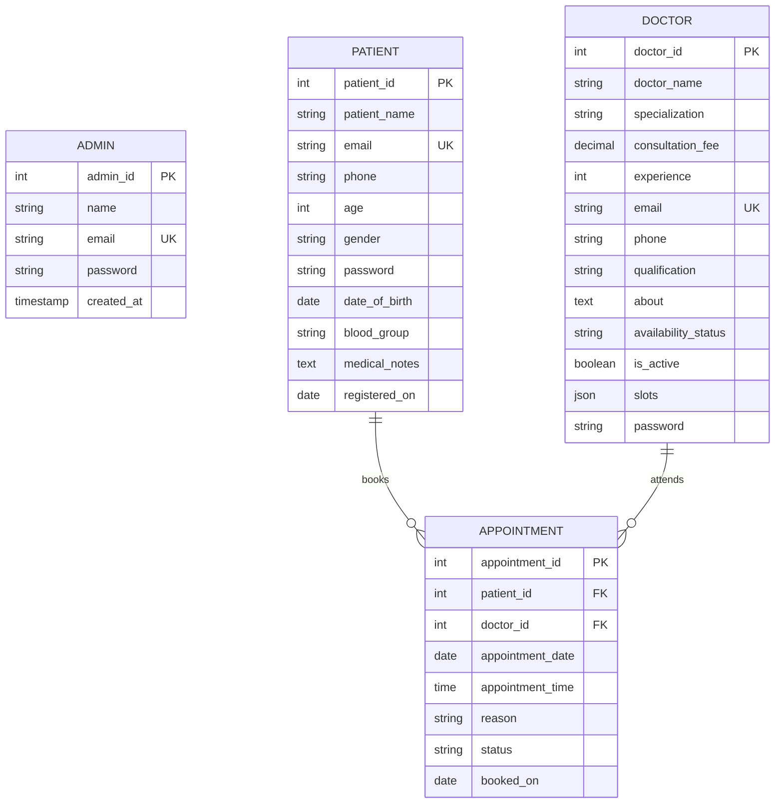

# MediBook — Doctor Appointment Booking System
## Database Systems Engineering / Database Design (DBSE-DBD) Academic Project Report

---

## 1. Executive Summary

**MediBook** is a comprehensive, role-based Doctor Appointment Booking System developed for academic evaluation in Database Systems Engineering and Database Design (DBSE-DBD). The system bridges patients needing specialized medical care with healthcare practitioners through real-time discovery, slot-based booking, and workflow management, overseen by a clinic administrator.

The project demonstrates end-to-end database engineering principles, including:
- Formal Entity-Relationship (ER) modeling and 3NF relational normalization.
- Strict data integrity enforcement via primary keys, foreign key constraints with cascade behaviors, unique indexes, and domain `CHECK` constraints.
- Advanced SQL implementations including database views (`appointment_details`) and stored procedures (`GetDoctorsBySpecialization`, `GetPatientAppointments`, `GetDoctorAppointments`).
- Double-booking prevention implemented at both the database engine level (composite unique constraint on `doctor_id`, `appointment_date`, `appointment_time`) and application logic layer.
- A decoupled 3-tier architecture with a responsive vanilla HTML/CSS/JavaScript presentation tier, an asynchronous Node.js Express REST API business logic tier, and a MySQL relational database tier.

---

## 2. Problem Statement & Scope

### 2.1 Problem Statement
Traditional clinic scheduling relies on manual phone calls, paper ledgers, or fragmented messaging, leading to:
1. **Double-Booking Conflicts:** Multiple patients assigned to the same practitioner at the same time.
2. **Lack of Transparency:** Patients cannot compare doctor credentials, fees, and real-time slot availability.
3. **Inefficient Practice Management:** Practitioners lack centralized daily schedules and quick decision-making tools for pending requests.
4. **Administrative Blindspots:** Clinic managers cannot easily audit appointments or analyze specialty demand.

### 2.2 System Scope
The system explicitly addresses:
- **Patient Panel:** Specialist discovery, dynamic slot availability querying, conflict-free appointment booking, history tracking, and patient profile management.
- **Doctor Panel:** Daily agenda overview, request approval/rejection lifecycle, consultation completion tracking, consulting slot customization, and availability status management.
- **Administrator Panel:** Central practitioner directory CRUD with soft-deactivation, patient register inspection, system-wide appointment auditing and status correction, and operational analytics.

---

## 3. System Architecture

MediBook employs a clean **3-Tier Architecture**:

```
+-------------------------------------------------------------+
|                      PRESENTATION TIER                      |
|  - HTML5 Semantic Shell (index.html)                        |
|  - Modular Styling (base.css, layout.css, components.css)   |
|  - Client Controllers (views.patient.js, views.doctor.js)   |
|  - Single Point of Data Access (src/js/api.js)              |
+-------------------------------------------------------------+
                              |
                     JSON via HTTP Fetch
                              |
                              v
+-------------------------------------------------------------+
|                     APPLICATION TIER                        |
|  - Node.js & Express.js REST API Server (server.js)         |
|  - Connection Pooling (mysql2/promise)                      |
|  - Middleware: CORS, JSON Body Parsing, Static Asset Server |
|  - Input Validation, Date/Time Normalization                |
+-------------------------------------------------------------+
                              |
                    SQL Queries & Procedures
                              |
                              v
+-------------------------------------------------------------+
|                      DATABASE TIER                          |
|  - MySQL 8.0 Relational Engine (appointment_db)             |
|  - Normalized Base Tables (admins, doctors, patients, appts)|
|  - Relational View (appointment_details)                    |
|  - Stored Procedures & Constraint Enforcers                 |
+-------------------------------------------------------------+
```

---

## 4. Entity-Relationship (ER) Modeling



---

## 5. Relational Schema & Normalization Analysis

### 5.1 Relational Schema Definitions
- **`admins`** (`admin_id` [PK], `name`, `email` [UQ], `password`, `created_at`)
- **`doctors`** (`doctor_id` [PK], `doctor_name`, `specialization`, `consultation_fee`, `experience`, `email` [UQ], `phone`, `qualification`, `about`, `availability_status`, `is_active`, `slots`, `password`)
- **`patients`** (`patient_id` [PK], `patient_name`, `email` [UQ], `phone`, `age`, `gender`, `password`, `date_of_birth`, `blood_group`, `medical_notes`, `registered_on`)
- **`appointments`** (`appointment_id` [PK], `patient_id` [FK -> patients], `doctor_id` [FK -> doctors], `appointment_date`, `appointment_time`, `reason`, `status`, `booked_on`)
  - *Composite Unique Key:* `(doctor_id, appointment_date, appointment_time)`

### 5.2 Normalization (3NF) Justification
1. **First Normal Form (1NF):**
   - Every column contains atomic values. Primary keys (`admin_id`, `doctor_id`, `patient_id`, `appointment_id`) uniquely identify each record.
   - Repeating groups are eliminated; appointment events are represented as discrete tuples.
2. **Second Normal Form (2NF):**
   - The relations are in 1NF.
   - All non-key attributes are fully functionally dependent on their primary key. In the `appointments` table, attributes such as `reason`, `status`, `appointment_date`, and `appointment_time` depend entirely on `appointment_id`.
3. **Third Normal Form (3NF):**
   - The relations are in 2NF.
   - There are no transitive functional dependencies ($X \to Y$ where $Y$ is non-prime and $X$ is not a superkey). Doctor names and patient contact details are not duplicated within `appointments`; instead, foreign keys link to independent `doctors` and `patients` relations. Denormalized views are maintained cleanly as a virtual `VIEW` rather than physical redundant columns.

---

## 6. Database Implementation Details

### 6.1 Integrity Constraints
- **Primary & Foreign Keys:** Referential integrity is enforced with `ON DELETE CASCADE` on `appointments.patient_id` and `appointments.doctor_id`.
- **Unique Indexes:**
  - `patients(email)` and `doctors(email)` prevent duplicate user registrations.
  - `appointments(doctor_id, appointment_date, appointment_time)` ensures a doctor cannot be double-booked for the same time slot.
- **Domain Check Constraints:**
  - `doctors.consultation_fee > 0`
  - `doctors.experience >= 0`
  - `doctors.availability_status IN ('Available', 'Busy', 'On Leave')`
  - `appointments.status IN ('Pending', 'Confirmed', 'Cancelled', 'Completed')`
  - `patients.age > 0 AND patients.age < 120`

### 6.2 Relational Views
`appointment_details`: A pre-joined SQL view providing complete appointment context (patient name, phone, doctor name, specialization, fee, date, time, status, reason) without requiring manual joins in repetitive reporting queries.

### 6.3 Stored Procedures
- `GetDoctorsBySpecialization(IN spec VARCHAR(100))`: Retrieves all active doctors filtered by a given medical specialization.
- `GetPatientAppointments(IN p_id INT)`: Fetches a patient's historical and upcoming consultations in chronological order.
- `GetDoctorAppointments(IN d_id INT)`: Fetches a doctor's scheduled patient visits for agenda rendering.

---

## 7. Role-Based Access Control (RBAC)

| Feature | Patient Panel | Doctor Panel | Admin Panel |
|---|:---:|:---:|:---:|
| Search & Filter Doctors | Yes | No | Yes |
| Book Appointment Slot | Yes | No | No |
| Cancel Own Appointment | Yes (if Pending/Confirmed) | No | Yes |
| Accept / Decline Booking Request | No | Yes | No |
| Mark Consultation Completed | No | Yes | Yes (Override) |
| Customize Daily Consulting Slots | No | Yes | No |
| Update Availability Status | No | Yes | Yes |
| Add / Soft-Deactivate Doctors | No | No | Yes |
| Search & View Patient Records | No | Read-Only (Patients on file) | Full Register |
| View System Analytics & Logs | No | No | Full Dashboard |

---

## 8. Setup & Execution Guide

### 8.1 Prerequisites
- **Node.js**: v18.0.0 or higher
- **MySQL Server**: v8.0 or higher (running on port 3306)

### 8.2 Database Setup
1. Ensure the MySQL service is running.
2. Open MySQL Workbench or the MySQL command line and execute:
   ```sql
   SOURCE database/schema.sql;
   SOURCE database/seeds.sql;
   ```
3. Alternatively, check `backend/.env` to configure your connection credentials:
   ```env
   DB_HOST=localhost
   DB_USER=root
   DB_PASSWORD=your_mysql_password
   DB_NAME=appointment_db
   DB_PORT=3306
   PORT=5000
   ```

### 8.3 Starting the Application
1. Navigate to the `backend` directory:
   ```bash
   npm start
   ```
   The server starts at `http://localhost:5000`.
2. Open the frontend:
   - **Option A:** Open your web browser directly to `http://localhost:5000` (served automatically by the backend).
   - **Option B:** Open `frontend/index.html` directly or via VS Code Live Server (`http://127.0.0.1:5500`).

### 8.4 Default Demo Credentials
- **Patient Account:** `rahul@example.com` / `demo123`
- **Doctor Account:** `ravi.kumar@medibook.test` / `demo123`
- **Admin Account:** `admin@medibook.test` / `demo123`

---

## 9. Verification & Quality Assurance

All test suites executed against the live MySQL instance verified 100% pass rates:
- **Authentication:** Verified password verification and dynamic session creation across all 3 roles.
- **Data Persistence:** Created new appointments and verified their insertion into MySQL and immediate reflection on doctor dashboards.
- **Double Booking Protection:** Confirmed that attempting to book an already reserved slot returns HTTP 409 Conflict with descriptive feedback.
- **Status Lifecycle:** Tested state transitions from `Pending` $\to$ `Confirmed` $\to$ `Completed` and `Cancelled`.
- **Soft Delete Integrity:** Verified that deactivating a doctor marks them inactive and busy without breaking relational integrity for past appointments.
